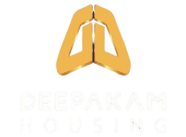
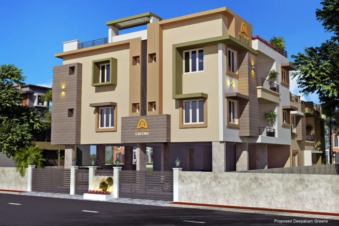

# Product Requirements Document (PRD)
## Deepakam Housing — Website Rebuild
**Version:** 1.0
**Prepared for:** Deepakam Housing Private Limited
**Tech Stack:** HTML, CSS, JavaScript (Vanilla)
**Reference:** deepakam.in (archived content)

---

## 1. Project Overview

Deepakam Housing requires a full website rebuild to replace the previous site (deepakam.in) which is currently unavailable. The new website must restore all original content using a clean HTML/CSS/JS stack, present a modern trustworthy real estate brand, and generate leads via enquiry forms.

---

## 2. Business Context

| Field | Details |
|---|---|
| Company Name | Deepakam Housing Private Limited |
| Type | Private Limited Company (Incorporated: 16 Feb 2018) |
| Industry | Real Estate — Residential & Commercial Development |
| Headquarters | Ambal Nagar, Pallikaranai, Chennai, Tamil Nadu — 600100 |
| Branch Office | Stadium Bypass Road, Palakkad, Kerala |
| Phone | 9444651111 |
| Website (old) | www.deepakam.in / www.deepakam.com |
| Employee Count | 11–50 |
| Founded | 2011 |
| Presence | Tamil Nadu & Kerala |

---

## 3. Brand Colors (From Logo)

| Role | Name | Hex |
|---|---|---|
| Primary | Navy Blue | `#1E3A6E` |
| Secondary | Gold / Amber | `#F0A830` |
| Primary Dark | Deep Navy | `#142B52` |
| Secondary Light | Light Gold | `#F7C35A` |
| Background Light | Off-White | `#F8F7F4` |
| Background Dark | Dark Navy | `#0F2040` |
| Text Primary | Near Black | `#1A1A1A` |
| Text Secondary | Grey | `#6B6B6B` |
| Text on Primary | White | `#FFFFFF` |
| Text on Secondary | Dark Navy | `#1E3A6E` |
| Border | Light Grey | `#E4E4E4` |
| Success / Active | Green | `#2A7D4F` |

**Usage Rules:**
- Primary `#1E3A6E` — navbar background, section backgrounds, headings, footer
- Secondary `#F0A830` — CTA buttons, badges, highlights, icon accents, hover states
- Never place gold text on white — use navy text on gold, or gold on navy
- All primary buttons: gold bg `#F0A830` + dark navy text `#1E3A6E`, border-radius 6px

---

## 4. Typography

| Usage | Font | Weight | Size (Desktop) |
|---|---|---|---|
| Hero H1 | Playfair Display | 700 | 52–64px |
| Section H2 | Playfair Display | 600 | 36–44px |
| Card Title H3 | Inter | 600 | 20–22px |
| Body | Inter | 400 | 16–17px |
| Caption / Label | Inter | 500 | 12–14px |
| Button | Inter | 600 | 15px |
| Nav Links | Inter | 500 | 15px |

**Google Fonts CDN (add to all HTML `<head>`):**
```html
<link rel="preconnect" href="https://fonts.googleapis.com">
<link href="https://fonts.googleapis.com/css2?family=Inter:wght@400;500;600&family=Playfair+Display:wght@600;700&display=swap" rel="stylesheet">
```

---

## 5. Goals

- Restore all existing content from the previous website
- Rebuild buyer credibility (testimonials, project pages, quality policy)
- Generate leads via enquiry forms and prominent CTAs
- Showcase completed and ongoing projects clearly
- Work well on mobile (responsive layout required)

---

## 6. Target Audience

- Home buyers in Chennai (Pallikaranai, Tambaram, OMR, Velachery belt)
- Home buyers in Palakkad, Kerala
- Property investors seeking affordable to mid-range apartments/villas
- NRI buyers looking for ready-to-move properties in South India

---

## 7. Site Map / File Structure

```
deepakam-housing/
├── index.html              ← Home
├── about.html              ← About Us
├── projects.html           ← All Projects (listing)
├── project-greens.html     ← Deepakam Greens detail
├── project-gardens.html    ← Deepakam Gardens detail
├── project-manor.html      ← Deepakam Manor detail
├── project-one.html        ← Deepakam ONE detail
├── project-villa.html      ← Villa Deepakam detail
├── project-apartments.html ← Deepakam Apartments detail
├── testimonials.html       ← Testimonials
├── contact.html            ← Contact Us
├── careers.html            ← Careers / Jobs
├── css/
│   ├── style.css           ← Global styles, variables, typography
│   ├── navbar.css          ← Header & nav
│   ├── footer.css          ← Footer
│   └── components.css      ← Cards, buttons, badges, forms
├── js/
│   ├── main.js             ← Scroll effects, navbar sticky, mobile menu
│   ├── carousel.js         ← Testimonial carousel
│   └── filter.js           ← Project filter (projects.html)
├── assets/
│   ├── logo.png            ← Deepakam Housing logo (provided)
│   ├── icons/              ← SVG icons
│   └── images/             ← Project images, hero backgrounds
```

---

## 8. CSS Variables (style.css root)

```css
:root {
  /* Brand Colors */
  --primary: #1E3A6E;
  --primary-dark: #142B52;
  --primary-light: #2A5298;
  --secondary: #F0A830;
  --secondary-light: #F7C35A;
  --secondary-dark: #D4911A;

  /* Backgrounds */
  --bg-light: #F8F7F4;
  --bg-dark: #0F2040;
  --bg-white: #FFFFFF;

  /* Text */
  --text-primary: #1A1A1A;
  --text-secondary: #6B6B6B;
  --text-on-primary: #FFFFFF;
  --text-on-secondary: #1E3A6E;

  /* UI */
  --border: #E4E4E4;
  --success: #2A7D4F;
  --shadow-sm: 0 2px 8px rgba(0,0,0,0.08);
  --shadow-md: 0 4px 20px rgba(0,0,0,0.12);
  --shadow-lg: 0 8px 40px rgba(0,0,0,0.16);

  /* Spacing */
  --section-py: 80px;
  --container-max: 1240px;
  --gap: 24px;

  /* Radius */
  --radius-sm: 6px;
  --radius-md: 12px;
  --radius-lg: 20px;
  --radius-pill: 999px;

  /* Font */
  --font-heading: 'Playfair Display', serif;
  --font-body: 'Inter', sans-serif;
}
```

---

## 9. Global Components

### 9.1 Navbar
- **Background:** `--primary` (`#1E3A6E`)
- **Logo:** Left-aligned, `logo.png`
- **Nav Links:** White text, hover underline in gold `--secondary`
- **Active link:** Gold color `--secondary`
- **CTA Button (right):** Gold bg `--secondary`, navy text, rounded 6px — label: `Enquire Now`
- **Mobile:** Hamburger icon (3-line, white), slide-down drawer, links stacked
- **Sticky:** Navbar sticks on scroll; add `box-shadow` when scrolled

```html
<!-- Navbar structure -->
<nav class="navbar">
  <div class="container navbar__inner">
    <a href="index.html" class="navbar__logo">
      
    </a>
    <ul class="navbar__links">
      <li><a href="index.html">Home</a></li>
      <li><a href="about.html">About Us</a></li>
      <li><a href="projects.html">Projects</a></li>
      <li><a href="testimonials.html">Testimonials</a></li>
      <li><a href="contact.html">Contact</a></li>
      <li><a href="careers.html">Careers</a></li>
    </ul>
    <a href="contact.html" class="btn btn--secondary">Enquire Now</a>
    <button class="navbar__hamburger" id="menuToggle">&#9776;</button>
  </div>
</nav>
```

### 9.2 Footer
- **Background:** `--bg-dark` (`#0F2040`)
- **Text:** White + grey secondary
- **Columns (4):**
  1. Logo + tagline + social icons (Facebook, LinkedIn)
  2. Quick Links (all pages)
  3. Projects list (all 6 projects)
  4. Contact info (both offices + phone)
- **Bottom bar:** Thin gold top-border, copyright text left, disclaimer link right
- **Legal Disclaimer:** Small grey text at very bottom of footer

### 9.3 Button Styles

```css
/* Primary CTA — Gold */
.btn--primary {
  background: var(--secondary);
  color: var(--text-on-secondary);
  padding: 14px 32px;
  border-radius: var(--radius-sm);
  font-weight: 600;
  border: none;
  cursor: pointer;
  transition: background 0.2s ease;
}
.btn--primary:hover { background: var(--secondary-dark); }

/* Secondary — Navy outline */
.btn--outline {
  background: transparent;
  border: 2px solid var(--primary);
  color: var(--primary);
  padding: 12px 28px;
  border-radius: var(--radius-sm);
}
.btn--outline:hover { background: var(--primary); color: white; }

/* Ghost — for use on dark/navy bg */
.btn--ghost {
  background: transparent;
  border: 2px solid white;
  color: white;
  padding: 12px 28px;
  border-radius: var(--radius-sm);
}
.btn--ghost:hover { background: rgba(255,255,255,0.1); }
```

### 9.4 Project Card

```html
<div class="project-card">
  <div class="project-card__img">
    
    <span class="badge badge--completed">Completed</span>
  </div>
  <div class="project-card__body">
    <span class="project-card__type">Life Style Apartments</span>
    <h3 class="project-card__title">Deepakam Greens</h3>
    <p class="project-card__location">📍 Pallikaranai, Chennai</p>
    <p class="project-card__bhk">2 BHK</p>
    <a href="project-greens.html" class="btn btn--primary">View Details</a>
  </div>
</div>
```

**Card CSS:**
- White bg, `--radius-md` corners, `--shadow-sm`
- On hover: `--shadow-md`, slight translateY(-4px)
- Image height: 220px, object-fit: cover
- Badge: absolute top-right, gold bg + navy text

### 9.5 Badges

```css
.badge { padding: 4px 12px; border-radius: var(--radius-pill); font-size: 12px; font-weight: 600; }
.badge--completed  { background: #D4EDDA; color: #2A7D4F; }
.badge--ready      { background: #CCE4FF; color: #1E3A6E; }
.badge--ongoing    { background: #FFF3CD; color: #856404; }
```

### 9.6 Section Heading Pattern

```html
<div class="section-header">
  <span class="section-label">OUR PROJECTS</span>  <!-- gold, uppercase, small -->
  <h2 class="section-title">Homes Built with Heart</h2>
  <p class="section-sub">Quality residential developments across Chennai and Palakkad</p>
</div>
```

```css
.section-label { color: var(--secondary); font-size: 13px; font-weight: 600; letter-spacing: 2px; text-transform: uppercase; }
.section-title { font-family: var(--font-heading); color: var(--primary); margin-top: 8px; }
```

### 9.7 Enquiry Form (Global — contact.html + project pages)

**Fields:**
- Full Name (text)
- Phone Number (tel)
- Email Address (email)
- Project of Interest (select dropdown — all 6 projects + "General Enquiry")
- Message (textarea, 4 rows)
- Submit: `Send Enquiry` — full-width, gold button

**Validation (JS):** All fields required, phone must be 10 digits, email format check. Show inline error messages in red on submit.

---

## 10. Page-by-Page Requirements

---

### 10.1 HOME PAGE (index.html)

#### Section 1: Hero
- **Layout:** Full-viewport height (100vh)
- **Background:** Large lifestyle/apartment image + overlay `rgba(14, 32, 64, 0.65)`
- **Content (left-aligned, centered vertically):**
  - Label: `TRUSTED DEVELOPER SINCE 2011` — gold, uppercase, 12px, letter-spacing 2px
  - H1: *"Building Homes, Delivering Dreams."*
  - Body: *"Quality residential & commercial developments across Tamil Nadu and Kerala."*
  - Buttons row: `Explore Projects` (gold btn) + `Enquire Now` (ghost btn)
- **Scroll arrow:** Animated bounce arrow at bottom center

#### Section 2: Stats Bar
- **Background:** `--primary` (`#1E3A6E`)
- **4 stats (flex row):**

| Number | Label |
|---|---|
| 6+ | Projects Completed |
| 100+ | Happy Families |
| 13+ | Years of Excellence |
| 2 | Cities |

- Stat number: large, gold color `--secondary`
- Label: white, small
- Separator: thin gold vertical line between each stat

#### Section 3: About Intro
- **Layout:** 2 columns — left text, right image
- **Heading:** *"A Developer You Can Trust"*
- **Body text:**
  > Deepakam Housing is dedicated to creating better Living Space, Commercial and Corporate Spaces at convenient locations focused with customer satisfaction. Established in Tamil Nadu and Kerala, we have successfully completed projects on time and to high standards.
- **Pull quote (gold left-border box):**
  > *"We believe every home should be built on a foundation of trust."*
- **Link:** `Learn More About Us →` (gold text link)

#### Section 4: Featured Projects
- **Background:** `--bg-light`
- **Section label:** `OUR PROJECTS`
- **Heading:** *"Homes Built with Heart"*
- **Grid:** 3 project cards (Deepakam Greens, Deepakam Manor, Villa Deepakam)
- **Bottom link:** `View All Projects →`

#### Section 5: Testimonials
- **Background:** White
- **Heading:** *"What Our Homeowners Say"*
- **Layout:** Carousel (JS — 1 visible on mobile, 2 on tablet, 3 on desktop)
- **Dot navigation + prev/next arrows**

#### Section 6: Contact CTA Banner
- **Background:** `--secondary` gold `#F0A830`
- **Text color:** `--primary` navy
- **Heading:** *"Find Your Dream Home Today"*
- **Sub-text:** Phone: 9444651111 | Chennai & Palakkad Offices
- **Button:** `Enquire Now` — navy bg, white text

#### Section 7: Office Addresses Strip
- **Background:** `--bg-dark`
- **2 office cards side by side:**
  - 📍 Deepakam ONE Apartments, Puthur, Palakkad – 678 001
  - 📍 Deepakam Apartments, Ambal Nagar, Pallikaranai, Chennai

---

### 10.2 ABOUT US PAGE (about.html)

#### Hero: Medium height (50vh), navy bg, white text, heading centered

#### Section 1: Company Overview
- 2-col layout: text left, building image right
- Heading: *"About Deepakam Housing"*
- Body:
  > Deepakam Housing Private Limited is a fast-growing organization focusing its primary business in the field of Housing and Commercial Developments. Deepakam Housing expands its span of operation into identification, acquisition and development of properties in Residential and Commercial sectors, Project planning, designing, execution, real estate management and leasing of commercial/retail space.
  >
  > Deepakam Housing has partnered with internationally acclaimed architects and design firms. The company is recognized for its quality construction, ethical and transparent business practices, and high standards of Property Development.
  >
  > Since inception, Deepakam Housing successfully follows on-time delivery of projects to its customers.

#### Section 2: Vision Card
- Full-width navy card `--primary`
- Gold icon (eye / star SVG)
- Heading: *"Our Vision"* (white, Playfair)
- Text: *"To become the most preferred developer for quality home buyers."* (white)

#### Section 3: Quality Policy
- White bg
- Heading: *"Quality Policy"*
- Body:
  > Deepakam Housing is committed to gratify its customers with Quality Creation and enhanced service through continuous recapitulation of its process, product and services. We focus to provide quality workmanship, on-time delivery with optimum cost to our customers. Deepakam Housing, our contractors and suppliers are committed to achieve the targeted quality standard through the guided principles to achieve customer satisfaction.

#### Section 4: Why Choose Us — 4 Icon Feature Blocks
- Layout: 4-column grid (2 on tablet, 1 on mobile)
- Background: `--bg-light`

| Icon | Title | Description |
|---|---|---|
| 🏗 | On-Time Delivery | Projects delivered as committed since inception |
| 🤝 | Ethical Business | Transparent dealings, no hidden conditions |
| 🏆 | Quality Construction | Partnered with acclaimed architects and design firms |
| 📍 | Prime Locations | Strategically located projects in Chennai & Palakkad |

- Card: white bg, gold icon top, navy title, grey body text

#### Section 5: Joint Venture CTA
- Bordered card (gold border), centered
- Text: *"Interested in partnering with us?"*
- Button: `Get in Touch` → links to contact.html

---

### 10.3 PROJECTS PAGE (projects.html)

#### Hero: Short 35vh, navy bg, heading: *"All Projects"*

#### Filter Bar (sticky on scroll)
- Background: white with bottom border
- Tabs: `All` | `Chennai` | `Palakkad` | `Completed` | `Ongoing`
- Active tab: gold underline + navy text
- JS: filter cards by `data-location` and `data-status` attributes

#### Project Grid
- 3 columns desktop, 2 tablet, 1 mobile
- All 6 project cards with filter data attributes:

```html
<div class="project-card" data-location="chennai" data-status="completed">
```

---

### 10.4 PROJECT DETAIL PAGES (project-*.html)

**Consistent layout for all 6 projects:**

1. **Image Hero** — full-width 55vh image + overlay with project name
2. **Breadcrumb:** Home > Projects > [Project Name]
3. **Two-column layout:**
   - **Left (70%):** Description, Key Details table, Nearby Landmarks list, Buyer Reviews
   - **Right (30%) sticky sidebar:** Enquiry form (Name, Phone, Email, Message, Submit)
4. **Key Details Table:**

```html
<table class="details-table">
  <tr><th>Project Type</th><td>Executive Apartments</td></tr>
  <tr><th>Configuration</th><td>2 BHK & 3 BHK</td></tr>
  <tr><th>Total Floors</th><td>G+3</td></tr>
  <tr><th>Location</th><td>Tambaram, Chennai</td></tr>
  <tr><th>Status</th><td><span class="badge badge--completed">Completed</span></td></tr>
  <tr><th>Possession</th><td>Ready to Move</td></tr>
</table>
```

5. **Nearby Landmarks:** Icon list (map pin gold icon + text)
6. **Buyer Reviews:** 1–2 testimonial cards (white bg, gold quote mark, review text, reviewer tag)
7. **Bottom CTA:** `Enquire About This Project` — full-width gold button

**Per-Project Content:**

**project-greens.html**
- Type: Life Style Apartments | BHK: 2 BHK | Location: ThukanathammanKoil Street, Pallikaranai, Chennai | Status: Completed | Floors: G+2
- Description: Deepakam Greens is ideally located in ThukanathammanKoil Street of Pallikaranai in a well-developed residential area. It has very good proximity to all the major amenities including Schools, Colleges, Banks and is just 2 minutes' drive from Velachery-Tambaram highway. GREENS has all 2 BHK apartments, completed and ready for occupation now.

**project-gardens.html**
- Type: Residential Apartments | BHK: 2 BHK & 3 BHK | Location: Pallikaranai, Chennai South | Status: Completed

**project-manor.html**
- Type: Executive Apartments | BHK: 2 BHK & 3 BHK | Location: Durga Nagar, Tambaram, Chennai | Status: Completed | Floors: G+3 | Price: ₹48.06 Lac – ₹69.99 Lac | Size: 640–890 Sq Ft
- Description: Deepakam MANOR is proposed in Durga Nagar, the Commercial Hub of Tambaram, Chennai. The project has very easy access to Bye-pass roads and GST Roads. It has very good proximity to all the major amenities including Schools, Colleges, Banks.

**project-one.html**
- Type: Premium Apartments | BHK: 2 BHK & 3 BHK | Location: Puthur, Palakkad – 678 001, Kerala | Status: Completed — Ready to Move | Floors: 4 | Total Units: 15 | Site Area: 0.44 Acres
- Description: Deepakam ONE is a splendid apartment project in Puthur, a classy location in Palakkad district. Excellent construction, amazing interiors and spacious units. Close to Govt. Medical College Palakkad, upcoming world-class shopping mall, Schools, Colleges and walkable to Kottukulangara temple.
- Nearby: Govt. Medical College Palakkad, upcoming shopping mall, Schools, Colleges, Kottukulangara temple, Devikripa Ayurveda Hospital, Lakshmi Narayana Hospital, PVS Clinics
- Feature: 24x7 Security

**project-villa.html**
- Type: Independent Villas | BHK: 3 BHK & 4 BHK | Location: Kannadi, Palakkad, Kerala | Status: Completed — Ready to Move | Price: ₹74.01 Lac – ₹81.69 Lac
- Description: Villa Deepakam is a fully completed, ready to move independent villa project with separate bore well, Water tank, septic tank and utility connections. On road property, ideally located very close to Trichur-Coimbatore Highway. Elegant architecture, perfectly designed 3 & 4 Bed villas with independent service provisions.
- Tagline: *"Close to nature with a touch of modernity — perfect for a quiet living amidst the bustle of the city."*
- Nearby: Govt. Medical College Palakkad, upcoming shopping mall, Schools, Colleges, Kottukulangara temple (walkable)

**project-apartments.html**
- Type: Residential Apartments | Location: Ambal Nagar, Pallikaranai, Chennai | Status: Completed

---

### 10.5 TESTIMONIALS PAGE (testimonials.html)

- Hero: Short, navy bg, heading: *"What Our Homeowners Say"*
- Layout: 3-column masonry-style card grid (CSS columns or JS Masonry)

**All 6 testimonials:**

**T1 — Deepakam Greens, Chennai**
> Some months back I was searching for apartments in Velachery and Medavakkam and I found this incredible property called Deepakam Housing in Pallikaranai, Chennai. It has 2 BHK residential apartments and it is a Disney-inspired project. I visited the plot and the amenities are comfortable. The homes are quite spacious and the location is also very nice. I have booked my home here and I am very happy. Overall a good pick compared to other premium properties nearby.

**T2 — Deepakam Greens, Pallikaranai**
> Super compact and affordable 2BHK apartments in Pallikaranai. After a lot of search around OMR and Velachery, found this project which is best in design, spacious, reasonable pricing, good ventilation and located conveniently.

**T3 — Deepakam ONE, Puthur, Palakkad**
> Deepakam ONE is a splendid Apartment in Puthur. Puthur is a classy place in Palakkad district. To have a home there is a dream. Deepakam fulfilled this dream too. A good apartment with excellent construction, amazing interiors and spacious. It's worth for the money. The warmth and care provided was amazing. Thank you for the smooth loan processing.

**T4 — Deepakam ONE, Puthur, Palakkad**
> Thank you for all the support right from visiting the property to handover. It was nice interacting with the Deepakam group. I was explained in detail about the construction and the material used for the property. Myself and my family are very happy and excited to get into our new home.

**T5 — Deepakam Apartments, Pallikaranai, Chennai**
> We are happy to endorse Deepakam Housing properties as good, elegantly designed and well built. Value for money and professional dealings. We are happy with Deepakam Apartments Project.

**T6 — Villa Deepakam / Deepakam Greens**
> Quiet place. Spacious and lovely cool breeze all through the day. Friendly neighbourhood community. Great apartment complex, peaceful and good for families from all backgrounds. A well-maintained building with a good leisure area. Best residential property in the area.

**Card Design:**
- White bg, `--radius-md`, `--shadow-sm`
- Large `"` — gold, 60px, Playfair
- Review text — body size, grey
- Reviewer: bold navy, small text — project name as grey tag below
- 5 gold stars SVG row

---

### 10.6 CONTACT PAGE (contact.html)

- Hero: Short navy hero, heading: *"Get In Touch With Us"*
- Sub-text: *"To get more information about our projects, feel free to contact our sales team or contact our office during working hours and we will be at your service."*

**2-Column Layout:**

**Left — Enquiry Form**
- Fields: Full Name, Phone Number, Email, Project of Interest (dropdown), Message
- Submit: `Send Enquiry` — gold button, full-width
- JS validation: required fields, 10-digit phone, email format

**Right — Contact Info**
- Office 1: 📍 Deepakam ONE Apartments, Puthur, Palakkad – 678 001, Kerala
- Office 2: 📍 Deepakam Apartments, Ambal Nagar, Pallikaranai, Chennai – 600100
- Phone: 📞 9444651111 (click to call link)
- Google Maps iframe (Pallikaranai, Chennai location embed)

**Sticky WhatsApp Button:**
- Fixed bottom-right corner
- Green circle, WhatsApp SVG icon
- Links to: `https://wa.me/919444651111`

---

### 10.7 CAREERS PAGE (careers.html)

- Hero: Navy, heading: *"Join Our Team"*
- Body: No active listings currently
- Placeholder text: *"We are always looking for talented professionals to join the Deepakam family. Send your resume to our office and we will get in touch when opportunities arise."*
- CTA: `Contact Us` button → contact.html

---

## 11. JavaScript Requirements

### main.js
- Navbar sticky on scroll (add `.scrolled` class → white bg or shadow)
- Mobile hamburger toggle (show/hide nav drawer)
- Smooth scroll for anchor links
- Scroll-reveal: fade-in sections as they enter viewport (IntersectionObserver)
- Stats counter animation (count up on scroll into view)

### carousel.js
- Auto-play testimonial carousel (3s interval)
- Prev / Next button controls
- Dot indicators (click to jump)
- Pause on hover
- Touch/swipe support (mobile)

### filter.js (projects.html only)
- Tab click filters `.project-card` elements by `data-location` and `data-status`
- Active tab styling update
- Smooth show/hide with CSS transition

### Form Validation (contact.html + project pages)
```js
// Validate on submit
// - All fields required
// - Phone: /^[0-9]{10}$/ 
// - Email: /^[^\s@]+@[^\s@]+\.[^\s@]+$/
// Show .error-msg below each invalid field (red text)
// On success: show green success message "Thank you! We will contact you shortly."
```

---

## 12. Responsive Breakpoints

```css
/* Mobile first */
/* Tablet */
@media (min-width: 768px) { }
/* Desktop */
@media (min-width: 1024px) { }
/* Large */
@media (min-width: 1280px) { }
```

| Element | Mobile | Tablet | Desktop |
|---|---|---|---|
| Nav | Hamburger drawer | Hamburger or full | Full horizontal |
| Hero H1 | 32px | 44px | 56–64px |
| Section padding | 40px | 60px | 80px |
| Project grid | 1 col | 2 col | 3 col |
| Feature blocks | 1 col | 2 col | 4 col |
| Contact layout | 1 col stacked | 1 col | 2 col |
| Sidebar (project detail) | Below content | Below content | Sticky right 30% |

---

## 13. Key Features / Functionality

| Feature | Priority |
|---|---|
| Mobile-responsive layout | High |
| Sticky navbar with mobile hamburger | High |
| Project listing with JS filter tabs | High |
| Individual project detail pages (6 pages) | High |
| Enquiry/Contact form with JS validation | High |
| Testimonials carousel (JS) | Medium |
| Scroll-reveal animations | Medium |
| Stats count-up animation | Medium |
| Google Maps embed (contact page) | Medium |
| WhatsApp sticky button | Medium |
| SEO meta tags (title, description per page) | High |
| Legal disclaimer in footer (all pages) | High |

---

## 14. SEO Meta Tags (per page)

Add to each HTML `<head>`:
```html
<!-- index.html -->
<title>Deepakam Housing — Quality Homes in Chennai & Palakkad</title>
<meta name="description" content="Deepakam Housing builds quality residential apartments and villas in Chennai and Palakkad. Explore completed and ongoing projects.">

<!-- about.html -->
<title>About Us — Deepakam Housing Private Limited</title>
<meta name="description" content="Learn about Deepakam Housing's vision, quality policy, and commitment to delivering homes on time across Tamil Nadu and Kerala.">

<!-- projects.html -->
<title>All Projects — Deepakam Housing | Apartments & Villas</title>
<meta name="description" content="Browse Deepakam Housing projects — Greens, Gardens, Manor, ONE, Villa Deepakam and more across Chennai and Palakkad.">

<!-- contact.html -->
<title>Contact Us — Deepakam Housing | Enquire About Projects</title>
<meta name="description" content="Contact Deepakam Housing at 9444651111. Offices in Pallikaranai Chennai and Puthur Palakkad. Enquire about our residential projects.">
```

---

## 15. Legal Disclaimer (All Pages — Footer)

```
The information provided in this website is for general purposes only and buyers should make independent assessment for any specific information. The interested parties should rely on buyers' sale and construction agreement which are comprehensive documents containing all terms and conditions. All visuals of projects including models, drawings, illustrations, photographs and art renderings represent artistic impressions only and are subject to change. We have not authorized anyone to make any oral promises or assurances on our behalf. Plans and specifications mentioned in Buyer-Seller Agreements are final and supersede the contents herein.
```

---

## 16. Out of Scope (Phase 1)

- Payment gateway / booking portal
- Customer login / dashboard
- CRM integration
- Backend / server-side form processing (use Formspree or mailto fallback)
- Property valuation calculator

---

## 17. Assets Required from Client

- [ ] Logo file (PNG with transparent bg — high resolution)
- [ ] Project photos for all 6 projects (minimum 3 images each)
- [ ] Hero/banner background image (lifestyle apartment exterior/interior)
- [ ] Confirmed pricing for all projects
- [ ] Floor plan PDFs (optional for Phase 1)
- [ ] Google Maps embed API key (or use free embed URL)
- [ ] Email address for form submissions

---

*Document prepared by RedMind Technologies for Deepakam Housing Private Limited.*